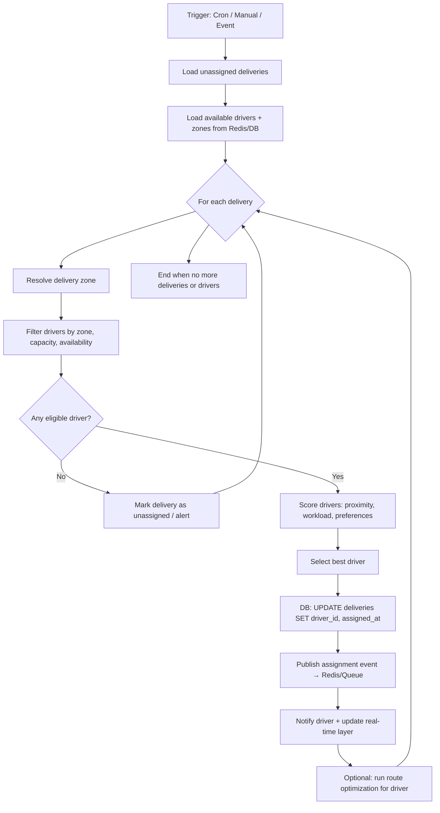

# Logistics and Delivery Management System — Technical Blueprint

**Document Version:** 1.0  
**Role:** Senior Enterprise Architect / Full-Stack Developer  
**Domain:** Supply Chain Management (SCM) — Order Management, Package Tracking, Driver Allocation

---

## 1. System Architecture Overview

### 1.1 Tech Stack

| Layer | Technology | Rationale |
|-------|------------|-----------|
| **Frontend** | React 18+ (TypeScript), TanStack Query, Zustand/Redux Toolkit, WebSocket client (socket.io-client) | SPA with type safety; real-time updates via WebSockets; optimistic UI for status transitions. |
| **API Gateway / BFF** | Kong or AWS API Gateway (optional) | Rate limiting, request validation, JWT verification at edge. |
| **Backend** | **Python 3.12 + FastAPI** | Async support, OpenAPI generation, Pydantic validation, WebSockets native. |
| **Database** | **PostgreSQL 15+** | ACID, JSONB for flexible payloads, full-text search, partitioning for orders/deliveries by date. |
| **Cache & Real-Time** | **Redis 7+** (pub/sub, streams, sorted sets) | Session store, real-time event bus, driver availability/location cache, job queues (Bull/Celery). |
| **Message Queue** | **Redis (Bull/Celery)** or **RabbitMQ** | Async tasks: notification dispatch, route computation, auto-assignment runs. |
| **External Integrations** | Google Maps APIs (Directions, Distance Matrix, Geocoding), SendGrid/Twilio (notifications) | Route planning, ETA, SMS/email. |

### 1.2 High-Level Architecture

```
┌─────────────────────────────────────────────────────────────────────────────────┐
│                              CLIENT LAYER                                         │
│  ┌──────────────┐  ┌──────────────┐  ┌──────────────┐  ┌──────────────┐         │
│  │ Admin Web    │  │ Fleet Mgr    │  │ Driver App   │  │ 3rd‑Party    │         │
│  │ (React)      │  │ (React)      │  │ (React/Mobile)│  │ (Webhooks)   │         │
│  └──────┬───────┘  └──────┬───────┘  └──────┬───────┘  └──────┬───────┘         │
└─────────┼─────────────────┼─────────────────┼─────────────────┼──────────────────┘
          │                 │                 │                 │
          ▼                 ▼                 ▼                 ▼
┌─────────────────────────────────────────────────────────────────────────────────┐
│                         API GATEWAY (Kong / Nginx)                                │
│                    TLS, rate limit, JWT validation, routing                        │
└─────────────────────────────────────────────────────────────────────────────────┘
          │
          ▼
┌─────────────────────────────────────────────────────────────────────────────────┐
│                         FASTAPI APPLICATION LAYER                                 │
│  ┌─────────────┐ ┌─────────────┐ ┌─────────────┐ ┌─────────────┐ ┌────────────┐ │
│  │ Orders API  │ │ Deliveries  │ │ Drivers     │ │ Routes      │ │ Analytics  │ │
│  │ (CRUD, FSM) │ │ (tracking,  │ │ (assign,    │ │ (plan,      │ │ (KPIs,     │ │
│  │             │ │  WebSocket) │ │  availability)│ │  schedule)  │ │  reports)  │ │
│  └──────┬──────┘ └──────┬──────┘ └──────┬──────┘ └──────┬──────┘ └─────┬──────┘ │
│         │               │               │               │               │        │
│  ┌──────┴───────────────┴───────────────┴───────────────┴───────────────┴──────┐ │
│  │  RBAC Middleware │ Audit Logger │ Notification Service │ Geo/Routes Service  │ │
│  └─────────────────────────────────────────────────────────────────────────────┘ │
└─────────────────────────────────────────────────────────────────────────────────┘
          │
          ├──────────────────┬──────────────────┬──────────────────┐
          ▼                  ▼                  ▼                  ▼
┌──────────────┐   ┌──────────────┐   ┌──────────────┐   ┌──────────────┐
│  PostgreSQL  │   │    Redis     │   │ Message Q    │   │ Google Maps  │
│  (primary)   │   │ (cache, pub/ │   │ (Celery/     │   │ Directions   │
│              │   │  sub, sets)  │   │  Bull)       │   │ API          │
└──────────────┘   └──────────────┘   └──────────────┘   └──────────────┘
```

### 1.3 Frontend / Backend / Database Responsibilities

- **Frontend:** Role-specific UIs (Admin, Fleet Manager, Driver), real-time dashboards, map views (e.g. Mapbox/Google Maps SDK), form-based CRUD, WebSocket subscription to delivery/order events.
- **Backend:** REST + WebSocket APIs, business rules (order state machine, assignment logic, route scoring), integration with Maps and notification providers, audit write-through, permission checks.
- **Database:** Persistence of core entities (users, roles, orders, deliveries, drivers, vehicles, routes, audit_logs), constraints and triggers for data integrity, materialized views or pre-aggregations for analytics.

---

## 2. Database Schema (Entity–Relationship)

### 2.1 Mermaid.js ER Diagram

```mermaid
erDiagram
    users ||--o{ user_roles : has
    roles ||--o{ user_roles : "assigned to"
    users ||--o| drivers : "may be"
    drivers ||--o{ vehicle_assignments : "uses"
    vehicles ||--o{ vehicle_assignments : "assigned to"
    
    orders ||--o{ order_items : contains
    orders ||--o| deliveries : "fulfilled by"
    deliveries }o--|| drivers : "assigned to"
    deliveries ||--o{ delivery_status_history : "status log"
    delivery_status_enum ||--o{ delivery_status_history : "state"
    
    zones ||--o{ delivery_addresses : "within"
    delivery_addresses ||--o{ orders : "ship to"
    routes ||--o{ route_stops : "contains"
    route_stops }o--|| deliveries : "stop for"
    routes }o--|| drivers : "executed by"
    
    users ||--o{ audit_logs : "actions by"
    orders ||--o{ audit_logs : "target"
    deliveries ||--o{ audit_logs : "target"
    
    users {
        uuid id PK
        varchar email UK
        varchar password_hash
        varchar full_name
        boolean is_active
        timestamptz created_at
        timestamptz updated_at
    }
    
    roles {
        uuid id PK
        varchar code UK "ADMIN, FLEET_MANAGER, DRIVER"
        varchar name
    }
    
    user_roles {
        uuid id PK
        uuid user_id FK
        uuid role_id FK
        uuid scope_zone_id "optional zone scope"
        timestamptz assigned_at
        unique(user_id, role_id, scope_zone_id)
    }
    
    drivers {
        uuid id PK
        uuid user_id FK UK
        varchar license_number
        varchar phone
        varchar status "AVAILABLE, BUSY, OFF_DUTY, BREAK"
        jsonb current_location "lat, lng, updated_at"
        timestamptz last_availability_updated
        boolean auto_assign_eligible
    }
    
    vehicles {
        uuid id PK
        varchar plate
        varchar type "VAN, TRUCK, BIKE"
        decimal capacity_kg
        boolean is_active
    }
    
    vehicle_assignments {
        uuid id PK
        uuid driver_id FK
        uuid vehicle_id FK
        date assigned_from
        date assigned_until
        unique(driver_id, assigned_from)
    }
    
    zones {
        uuid id PK
        varchar name
        jsonb polygon "GeoJSON or lat/lng list"
        uuid parent_zone_id FK "optional hierarchy"
    }
    
    delivery_addresses {
        uuid id PK
        varchar line1
        varchar line2
        varchar city
        varchar postal_code
        varchar country
        decimal lat
        decimal lng
        uuid zone_id FK
    }
    
    orders {
        uuid id PK
        varchar external_reference UK
        uuid delivery_address_id FK
        varchar customer_name
        varchar customer_phone
        varchar customer_email
        varchar status "DRAFT, CONFIRMED, PREPARING, READY_FOR_PICKUP, CANCELLED"
        timestamptz requested_delivery_start
        timestamptz requested_delivery_end
        decimal total_weight_kg
        text notes
        timestamptz created_at
        timestamptz updated_at
        uuid created_by FK
    }
    
    order_items {
        uuid id PK
        uuid order_id FK
        varchar sku
        varchar description
        int quantity
        decimal weight_kg
    }
    
    delivery_status_enum {
        varchar code PK "PREPARATION, IN_TRANSIT, DELIVERED, FAILED, RETURNED"
        int sort_order
    }
    
    deliveries {
        uuid id PK
        uuid order_id FK UK
        uuid driver_id FK "nullable until assigned"
        uuid assigned_by FK "user who assigned"
        timestamptz assigned_at
        varchar status "PREPARATION, IN_TRANSIT, DELIVERED, FAILED, RETURNED"
        timestamptz status_changed_at
        decimal estimated_distance_km
        int estimated_duration_mins
        timestamptz estimated_arrival
        jsonb route_snapshot "polyline, steps from Maps API"
        text failure_reason
        timestamptz created_at
        timestamptz updated_at
    }
    
    delivery_status_history {
        uuid id PK
        uuid delivery_id FK
        varchar status
        varchar previous_status
        jsonb payload "location, proof, etc."
        uuid changed_by FK
        timestamptz created_at
    }
    
    routes {
        uuid id PK
        uuid driver_id FK
        date planned_date
        varchar status "DRAFT, PUBLISHED, IN_PROGRESS, COMPLETED"
        jsonb waypoints "ordered list of delivery_ids or addresses"
        int total_stops
        decimal total_distance_km
        int total_duration_mins
        timestamptz created_at
        timestamptz updated_at
    }
    
    route_stops {
        uuid id PK
        uuid route_id FK
        uuid delivery_id FK
        int sequence
        timestamptz estimated_arrival
        varchar status "PENDING, ARRIVED, COMPLETED, SKIPPED"
        unique(route_id, sequence)
    }
    
    audit_logs {
        uuid id PK
        uuid user_id FK "nullable for system"
        varchar action "CREATE, UPDATE, DELETE, STATUS_CHANGE, ASSIGN"
        varchar resource_type "order, delivery, driver, route"
        uuid resource_id
        jsonb old_value
        jsonb new_value
        inet client_ip
        varchar user_agent
        timestamptz created_at
    }
    
    notifications {
        uuid id PK
        uuid user_id FK
        varchar channel "EMAIL, SMS, PUSH, IN_APP"
        varchar topic "delivery_status, assignment, delay_alert"
        uuid reference_id "delivery_id or order_id"
        varchar status "PENDING, SENT, FAILED"
        jsonb payload
        timestamptz sent_at
        timestamptz created_at
    }
```

### 2.2 Key Entity Notes

- **Order status** and **delivery status** are separate: an order moves through lifecycle (DRAFT → CONFIRMED → PREPARING → READY_FOR_PICKUP); a delivery uses the state machine PREPARATION → IN_TRANSIT → DELIVERED (or FAILED / RETURNED).
- **Driver availability** is kept in `drivers.status` and refreshed via API/WebSocket; Redis holds a live set `driver:available:{zone_id}` for fast auto-assignment lookups.
- **Route planning** stores a snapshot in `routes` and `route_stops`; actual geometry can live in `deliveries.route_snapshot` or a dedicated `route_legs` table if needed.
- **Audit logs** support traceability: every mutation on orders, deliveries, and assignments writes an audit row with `old_value` / `new_value` and `user_id`.

---

## 3. Key API Endpoints (RESTful Structure)

Base path: `/api/v1`. All mutation endpoints require `Authorization: Bearer <JWT>` and enforce RBAC.

### 3.1 Orders

| Method | Path | Description | Roles |
|--------|------|-------------|-------|
| `GET` | `/orders` | List orders (filters: status, date range, zone, customer) | Admin, Fleet Manager |
| `GET` | `/orders/{id}` | Get order by id (includes items, address, linked delivery) | Admin, Fleet Manager, Driver (own) |
| `POST` | `/orders` | Create order | Admin, Fleet Manager |
| `PATCH` | `/orders/{id}` | Partial update (validated status transitions) | Admin, Fleet Manager |
| `DELETE` | `/orders/{id}` | Soft-delete or cancel (business rule) | Admin |
| `POST` | `/orders/{id}/transition` | Explicit state transition (e.g. CONFIRMED → PREPARING) | Admin, Fleet Manager |

### 3.2 Deliveries & Tracking

| Method | Path | Description | Roles |
|--------|------|-------------|-------|
| `GET` | `/deliveries` | List deliveries (filters: status, driver, date, zone) | Admin, Fleet Manager, Driver (own) |
| `GET` | `/deliveries/{id}` | Get delivery with status history and route snapshot | Admin, Fleet Manager, Driver (own) |
| `POST` | `/deliveries` | Create delivery from order (idempotent by order_id) | Admin, Fleet Manager |
| `PATCH` | `/deliveries/{id}` | Update metadata (e.g. notes) | Admin, Fleet Manager |
| `POST` | `/deliveries/{id}/status` | Transition status (PREPARATION→IN_TRANSIT→DELIVERED; body: `status`, optional `location`, `proof`) | Fleet Manager, Driver (own) |
| `GET` | `/deliveries/{id}/track` | WebSocket or SSE for real-time tracking events | Admin, Fleet Manager, Driver, Client token |
| `POST` | `/deliveries/{id}/location` | Driver heartbeat (lat/lng); updates ETA if IN_TRANSIT | Driver |

### 3.3 Drivers & Assignment

| Method | Path | Description | Roles |
|--------|------|-------------|-------|
| `GET` | `/drivers` | List drivers (filters: status, zone, auto_assign_eligible) | Admin, Fleet Manager |
| `GET` | `/drivers/{id}` | Driver profile, current assignments, availability | Admin, Fleet Manager, Driver (self) |
| `PATCH` | `/drivers/{id}` | Update profile, vehicle, auto_assign_eligible | Admin, Fleet Manager |
| `POST` | `/drivers/{id}/availability` | Set status (AVAILABLE, OFF_DUTY, BREAK); updates Redis | Driver, Fleet Manager |
| `POST` | `/deliveries/{id}/assign` | Manual assign driver (body: `driver_id`) | Admin, Fleet Manager |
| `POST` | `/deliveries/assign-auto` | Trigger automatic assignment for unassigned deliveries (body: optional filters) | Admin, Fleet Manager |
| `GET` | `/drivers/available` | Snapshot of available drivers by zone (for UI) | Fleet Manager |

### 3.4 Routes & Scheduling

| Method | Path | Description | Roles |
|--------|------|-------------|-------|
| `GET` | `/routes` | List routes (filters: driver, date, status) | Admin, Fleet Manager, Driver (own) |
| `GET` | `/routes/{id}` | Route with stops and ETAs | Admin, Fleet Manager, Driver (own) |
| `POST` | `/routes` | Create route (body: driver_id, date, delivery_ids or address_ids) | Fleet Manager |
| `PATCH` | `/routes/{id}` | Reorder stops, add/remove stops | Fleet Manager |
| `POST` | `/routes/{id}/optimize` | Recompute order using Distance Matrix + TSP heuristic | Fleet Manager |
| `POST` | `/routes/{id}/publish` | Set status to PUBLISHED (driver sees it) | Fleet Manager |

### 3.5 Analytics & KPIs

| Method | Path | Description | Roles |
|--------|------|-------------|-------|
| `GET` | `/analytics/kpis` | Aggregated KPIs (delivery speed, delay rate, driver efficiency) with dimensions (date, zone, driver) | Admin, Fleet Manager |
| `GET` | `/analytics/deliveries` | Delivery metrics (count by status, avg duration, delay frequency) | Admin, Fleet Manager |
| `GET` | `/analytics/drivers` | Per-driver stats (deliveries completed, avg time, utilization) | Admin, Fleet Manager |

### 3.6 Security & Audit

| Method | Path | Description | Roles |
|--------|------|-------------|-------|
| `POST` | `/auth/login` | Issue JWT (and optional refresh token) | Public |
| `POST` | `/auth/refresh` | Refresh access token | Authenticated |
| `GET` | `/audit-logs` | Query audit trail (resource_type, resource_id, user_id, date range) | Admin |
| `GET` | `/me` | Current user + roles + permissions | Authenticated |

---

## 4. Logic Flow: Automatic Driver Assignment

### 4.1 Preconditions

- Deliveries in status `PREPARATION` or a dedicated `UNASSIGNED` with `driver_id IS NULL`.
- At least one driver with `status = 'AVAILABLE'`, `auto_assign_eligible = true`, and optional zone/vehicle constraints.
- Assignment run is triggered by: schedule (e.g. every 5 min), manual “Assign auto” action, or event (e.g. order READY_FOR_PICKUP).

### 4.2 Algorithm (High-Level)

1. **Fetch unassigned deliveries** (e.g. `PREPARATION`, `requested_delivery_start` within next N hours), ordered by requested time.
2. **Fetch available drivers** from DB and enrich with Redis `driver:available:{zone_id}` and current workload (today’s delivery count).
3. **For each delivery:**
   - Resolve **delivery zone** from `delivery_addresses.zone_id` (or geocode → zone lookup).
   - **Filter drivers** by zone (if zone-scoped), vehicle capacity vs. order weight, and availability.
   - **Score drivers** using:
     - Proximity (driver’s last known location → delivery address; Distance Matrix or straight-line).
     - Current load (prefer lower-loaded).
     - Eligibility and preference flags.
   - **Select best driver** (e.g. highest score or least additional distance).
   - **Assign** (update `deliveries.driver_id`, `assigned_at`, `assigned_by=system`) and **append to driver’s implied route** for the day (or create/update `routes`).
   - **Publish event** (Redis pub/sub or queue) so notification and real-time services send “You have a new delivery” and update WebSocket clients.
4. **Post-assignment:** Optionally run **route optimization** for each affected driver (reorder stops, update ETAs).

### 4.3 Mermaid Flowchart: Automatic Driver Assignment



### 4.4 Integration Points

- **Google Distance Matrix API:** For “driver current location → delivery address” and “depot → delivery” to compute scores and ETAs.
- **Redis:** `driver:available:{zone_id}`, `driver:location:{driver_id}` (optional TTL), and pub/sub channel `assignments` for notifications.
- **Queue (Celery/Bull):** Task `auto_assign.run(batch_id, options)` to avoid blocking the HTTP request; idempotent by `(delivery_id, run_id)`.

---

## 5. Security & Traceability Protocol

### 5.1 Role-Based Access Control (RBAC)

- **Roles:** `ADMIN`, `FLEET_MANAGER`, `DRIVER`.
- **Model:** `users` ↔ `user_roles` ↔ `roles`; optional `scope_zone_id` to restrict Fleet Managers to a subset of zones.
- **Enforcement:** Per-request dependency in FastAPI that resolves JWT → user → roles and checks permission for `(resource_type, action)`.
  - Example mappings:
    - `ADMIN`: full access to orders, deliveries, drivers, routes, audit, users.
    - `FLEET_MANAGER`: CRUD orders/deliveries/routes, assign drivers, view drivers and analytics; scope by zone if set.
    - `DRIVER`: read/update own profile, availability, and assigned deliveries/routes; submit location and status updates only for own deliveries.
- **Implementation:** Permission matrix in config or DB (`role_permissions`); middleware or dependency `require_permission("delivery", "assign")` before handler.

### 5.2 Authentication & Sessions

- **JWT access token** (short-lived, e.g. 15 min), signed with HS256/RS256; claim `sub=user_id`, `roles=[], scope_zone_id`.
- **Refresh token** (longer-lived, stored in DB or Redis) for renewing access without re-login.
- **Sensitive routes** (e.g. cancel order, delete driver): optional step-up (re-auth or 2FA) or second factor.

### 5.3 Audit Logging (Traceability)

- **When:** Every state change and assignment: order create/update/delete, delivery create/status change/assign, route publish, driver availability change.
- **What to log:** `user_id`, `action`, `resource_type`, `resource_id`, `old_value` (JSONB snapshot before), `new_value` (after), `client_ip`, `user_agent`, `created_at`.
- **Where:** Dedicated `audit_logs` table; optionally stream to cold storage or SIEM.
- **Idempotency:** For automated actions (e.g. auto-assign), use `assigned_by=system` and a `run_id` or `batch_id` in metadata so traces are reproducible.

### 5.4 Data & Transport Security

- **TLS only** for API and WebSockets (HTTPS, WSS).
- **Secrets:** DB credentials, Redis, API keys (Maps, SendGrid) in env or secret manager (e.g. Vault, AWS Secrets Manager); never in code.
- **PII:** Minimize logging of customer_phone/customer_email in audit `old_value`/`new_value`; mask or hash where required by policy.

### 5.5 Threat Mitigation

- **Rate limiting:** Per-IP and per-user on login and mutation endpoints (e.g. Kong or app-level).
- **Input validation:** Pydantic schemas on all request bodies; strict allowlists for status transitions and enums.
- **SQL/NoSQL injection:** Parameterized queries and ORM (SQLAlchemy/async); no raw query composition from user input.
- **CORS:** Restrict origins to known frontend and webhook consumers.

---

## 6. Implementation Roadmap (Phased)

| Phase | Scope | Deliverables |
|-------|--------|--------------|
| **P1 — Foundation** | Auth, RBAC, users, roles, audit, PostgreSQL schema, base FastAPI app | Deployable API with `/auth`, `/me`, `/audit-logs` and DB migrations |
| **P2 — Orders & Addresses** | Orders CRUD, order status lifecycle, delivery addresses, zones | `/orders`, `/delivery-addresses`, `/zones` and state validation |
| **P3 — Deliveries & Tracking** | Deliveries entity, status FSM (PREPARATION→IN_TRANSIT→DELIVERED), WebSocket/SSE, notifications | `/deliveries`, `/deliveries/{id}/status`, tracking channel, notification worker |
| **P4 — Drivers & Assignment** | Drivers, vehicles, availability (DB + Redis), manual assign, auto-assign job | `/drivers`, `/deliveries/{id}/assign`, `/deliveries/assign-auto`, Celery task + Distance Matrix |
| **P5 — Routes & Scheduling** | Routes, route_stops, optimize endpoint, publish | `/routes`, `/routes/{id}/optimize`, `/routes/{id}/publish` |
| **P6 — Analytics & KPIs** | Aggregations, materialized views or reporting DB, dashboard APIs | `/analytics/kpis`, `/analytics/deliveries`, `/analytics/drivers` |
| **P7 — Frontend & Polish** | Role-specific UIs, maps, real-time updates, operational hardening | Admin/Fleet/Driver apps, E2E tests, monitoring, runbooks |

---

*This blueprint is intended as the single source of truth for architecture, data model, APIs, assignment logic, and security. Implementation details (e.g. exact Pydantic models, SQL migrations) should align with these structures.*
